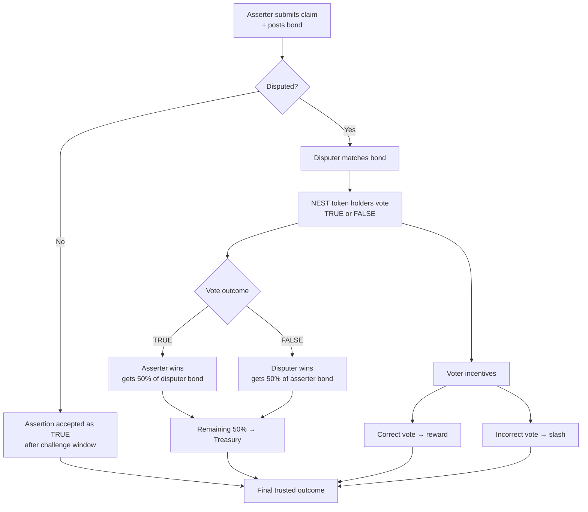

# Nest - Optimistic Oracle on Near

Nest is an optimistic oracle on NEAR that lets anyone post claims, challenge incorrect claims, and resolve disputes through a token-weighted verification mechanism.

Nest is a modular truth-resolution layer for NEAR. It combines an Optimistic Oracle (fast assertions with bonded liveness windows), optional escalation policies, and a DVM-style dispute process for objective settlement when claims are contested. The project includes smart contracts, indexers, and a frontend so teams can run the full flow end-to-end: propose -> dispute -> vote -> settle.

## Hackathon FYI

### Ping Pay

Ping Pay is useful for this project in two key ways:

1. **Instant USDC onramping**  
   This improves the user onboarding flow for Nest Prediction Markets, especially for first-time users who need USDC quickly.

2. **Path to multi-chain markets**  
   By accepting USDC bridged through intents on Ping infrastructure, markets can become chain-agnostic and harder to fragment.
   Current blocker: this is pending until Ping releases `ft_transfer_call` support.


## What Problem Nest Solves

Smart contracts are excellent at enforcing logic, but weak at deciding truth about events that happen outside the chain. Most applications either:

- trust a centralized backend,
- depend on narrow API-integrated data sources, or
- ship without a robust dispute process.

Nest solves this by giving NEAR apps a generalized truth-resolution mechanism:

- anyone can assert a claim with economic skin in the game (bond),
- anyone can challenge that claim within a liveness window,
- disputes are resolved through token-weighted voting and settlement rules.

This lets builders bring a much wider class of real-world and cross-domain data onchain with accountable, economically secured resolution.

## This is the flow of an Optimistic Oracle

Before going deeper, here is the core Optimistic Oracle flow in simple terms.

1. A user submits an assertion (a claim) and posts a bond in fungible tokens.
2. The claim is treated as true by default during a liveness window unless challenged.
3. If another user disagrees, they can dispute by posting a matching bond.
4. Once disputed, the claim is escalated to NEST token holders, who vote on whether the assertion is true or false.
5. Settlement distributes economic outcomes:
   - The winning side receives a reward from the losing side's bond.
   - The protocol treasury receives the configured remainder/fees.
6. Voters are economically aligned:
   - Correct votes are rewarded.
   - Incorrect votes can be penalized (slashed).

This design gives fast default resolution for uncontested claims, and strong economic/finality guarantees when claims are contested.


## Understanding all the cogs of the mechanism 

Nest is split into four repos that map directly to product, protocol, data, and real usage.

1. `nest-ui` (this repo)  
   Frontend for the full oracle lifecycle: create assertions, monitor liveness, dispute claims, participate in voting-related flows, and trigger settlement actions. Visit this first to understand user experience and to run a live demo quickly.

2. [`nest-contracts`](https://github.com/Nest-on-near/nest-contracts)  
   Core protocol contracts: Optimistic Oracle, voting/DVM, token economics, registry/finder, and settlement logic. Visit this to understand trust guarantees, economic rules, and how disputes are resolved onchain.

3. [`nest-indexer`](https://github.com/Nest-on-near/nest-indexer)  
   Event ingestion and query layer for assertions/disputes/settlements, exposed through API endpoints used by the UI. Visit this if you want to inspect data flow, API behavior, or debug state transitions in real time.

4. [`nest-markets`](https://github.com/Nest-on-near/nest-markets)  
   A concrete integration that uses Nest in a prediction-market context. Visit this to see why Nest matters in practice: objective market resolution, challenge windows, and verifiable outcomes for real applications.

5. [`nest-agent-skills`](https://github.com/Nest-on-near/nest-skills)  
   Agent skill-pack and workflow accelerators for the Nest ecosystem. Visit this to understand how developer/agent workflows are standardized for faster integrations, repeatable ops, and smoother hackathon execution.

## Design Choices

- **Optimistic assertions instead of Yield and Resume**  
 While building the Oracle the main concern or thought that comes to one's mind is why not YIELD AND RESUME? The answer .. it only allows actions through APIs. APIs can only cover such a wide domain, at the end of the day an Optimistic Oracle can be used to assert ANY type of data.

- **Challenge-window first, committee only when needed**  
  Most claims are expected to be uncontested, so default acceptance after liveness gives low-latency and low-cost resolution. Dispute voting is triggered only when someone is willing to economically challenge a claim.

- **Economic security over centralized moderation**  
  Bonds, rewards, treasury routing, and slashing align participants financially. Instead of trusting a single operator to approve truth, the protocol makes incorrect behavior expensive.

- **Modular architecture (UI, contracts, indexer, integrations)**  
  Product surface, onchain logic, data indexing, and application integrations are separated across repos. This keeps each layer simpler to reason about and allows independent iteration.

- **Indexer-backed UX for fast state visibility**  
  UI reads from indexer APIs for responsive query/filter experiences, while final correctness still comes from onchain contract state. This gives better developer and user ergonomics without compromising settlement authority.

## Run Locally

### Prerequisites

- Node.js `>=18`
- Rust toolchain (`cargo`)
- A NEAR testnet wallet account with enough gas

### 1. Start the Oracle Indexer

```bash
cd ../nest-indexer
cp .env.example .env
cargo run
```

Expected endpoints:

- `http://127.0.0.1:3001/health`
- `http://127.0.0.1:3001/docs`
- `http://127.0.0.1:3001/openapi.json`

### 2. Start the UI

```bash
cp .env.example .env.local
npm install
npm run dev
```

Open:

- `http://localhost:3000`

### 3. Demo Flow

1. Connect wallet (testnet).
2. Go to `/app/propose` and submit an assertion.
3. Go to `/app/verify` to view/dispute.
4. Go to `/app/vote` for dispute voting flow.
5. Go to `/app/settled` to inspect final outcomes.
